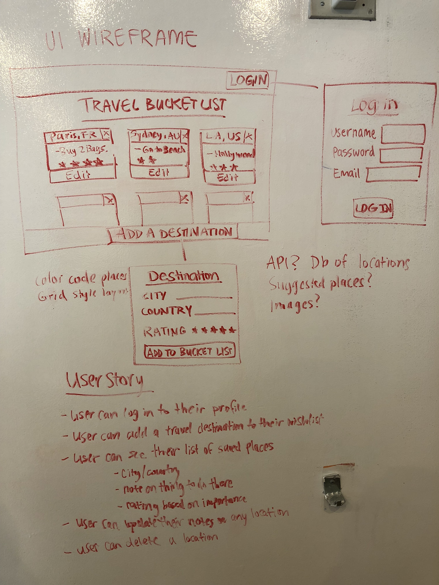

# Project name: 
Travel Bucket List

## Project description: 
CRUD app, wish list of popular travel locations with rating and description

## Wireframe: 

## User stories: 
User can make a post it style layout grid list of places they want to visit with notes on things to do and a rating out of five stars.
User can add, look at, edit, and delete destinations.

## Technologies: 
Javascript, PSQL, HTML, CSS

## API: 
Google Geolocation API, CountryAPI

## Modules: 
Express, Nodemon, EJS, Morgan, Body-parser, Pg-promise, Method-override

## Code snippet:

## Plan to fix/ features to add:
log in authorization and authentication
color code notes by location 
order notes by rating

## Instructions for downloading the code and running it on localhost:

